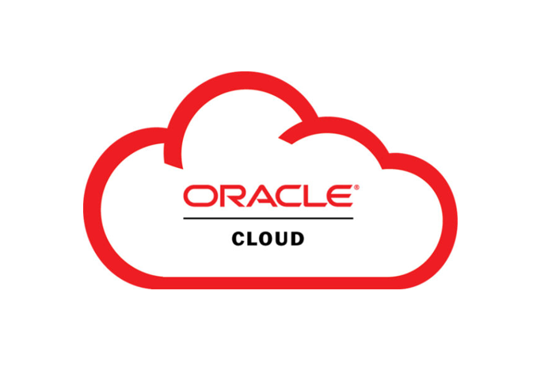
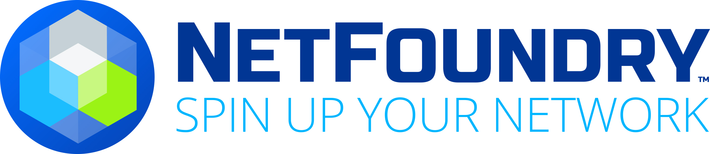
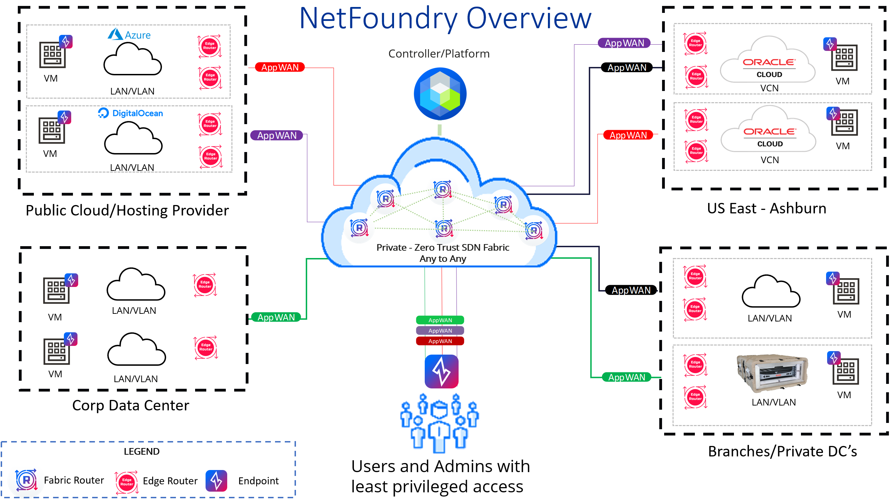
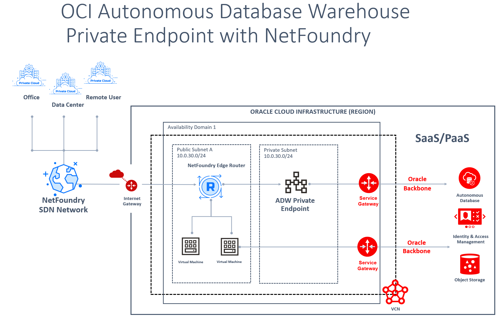
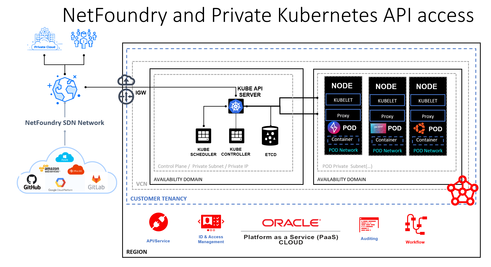

##### Summer 2022 Oracle Enablement Blog
](images/o-sponsorship.png)

#### Digital Transformation Means Companies Need Multicloud and NetFoundry is here to help.

 
We’ve moved beyond the idea of “a” cloud or “the” cloud and into multicloud in the hyper-connected enterprise era. In addition to off-the-shelf business applications, whether for ERP, CRM, or RTC, enterprises are now developing their own custom applications. Furthermore, as IoT and IIoT start to pervade enterprises as more intelligently connected things help businesses run more efficiently, that means more apps, and more clouds, plural.

Where applications are prototyped, developed, tested, and scaled depends on how internal or external those applications are, how secure they must be with how many layers of authentication, how regulated they may be, and how rich in multimedia they need to operate as more and more live video is coming online, for marketing, training, and live collaboration.

Oracle and it's partner NetFoundry solve the challenges of working in a Hybrid environment. There is no “one cloud fits all” and with the growth of “everything as a service,” enterprises are licensing applications hosted on other people’s clouds, some public, some private, and increasingly some form of hybrid.

On Date TBA, NetFoundry will present a live demonstration of how to enable OCi customers to utilize the NetFoundry Zero Trust platform for Hybrid Cloud applications including Web, Kubernetes and Database. Additionally, please find the following Oracle ands NetFoundry links to previously created documentation regarding various solutions which includes getting started guides, blogs, support guides and Build and Deploy documentation.

[Oracle Blog - Establish connectivity to Oracle Autonomous Database with NetFoundry Zero Trust networking.](https://blogs.oracle.com/cloud-infrastructure/post/zero-trust-network-access-with-netfoundry)

[Oracle Blog -- Connecting to OKE private API with NetFoundry networking](https://blogs.oracle.com/cloud-infrastructure/post/connecting-to-oke-private-api-with-netfoundry-networking)

[Oracle Blog -- OpenZiti -- Information about NetFoundry open source version for public consumption](https://blogs.oracle.com/javamagazine/post/java-zero-trust-openziti)

[Oracle Docs -- NetFoundry: Autonomous Data Warehouse deployment on Oracle Cloud Infrastructure](https://docs.oracle.com/en/solutions/netfoundry-adw-on-oci/index.html)

[Oracle Docs -- Kubernetes integration on Oracle Cloud Infrastructure](https://docs.oracle.com/en/solutions/netfoundry-oke-on-oci/index.html)

[Oracle Live Labs -- NetFoundry Setup on OCI](https://apexapps.oracle.com/pls/apex/dbpm/r/livelabs/view-workshop?wid=829)

[Oracle Quickstart Guide -- (Coming soon!!!)](https://github.com/oracle-quickstart/oci-netfoundry)

[NetFoundry Live Labs on GitHub - Spin up Your Network](https://github.com/ojbfive/oci-naas-ztna-netfoundry)

[NetFoundry support guide -- How to use NetFoundry ZTNA platform with OCI.
](https://support.netfoundry.io/hc/en-us/articles/360055462471-Getting-started-with-NetFoundry-Zero-Trust-Networking-Oracle-example-setup-)

[NetFoundry support guide -- Configure NetFoundry Zero Trust Networking for Oracle Autonomous Database (ADW) private endpoint access.](https://support.netfoundry.io/hc/en-us/articles/360055772252-Configure-NetFoundry-Zero-Trust-Networking-for-Oracle-Autonomous-Database-ADW-private-endpoint-access-)

[NetFoundry support guide -- Deploy NetFoundry Edge Routers in OCI from Marketplace image. tenancy.](https://support.netfoundry.io/hc/en-us/articles/360054992952-Deployment-Guide-for-Oracle-Cloud-Edge-Routers)

The average enterprise runs hundreds or even thousands of these applications and microservices, and they all “need network” and up and coming “micronets”. Whether internally-facing for employees or externally facing for customers, partners, suppliers, increasingly these applications are running in public cloud environments including Amazon Web Services, Microsoft Azure, and Google Cloud Platform and as demand continues to increase, so does competition. The economics are fascinating, with a great deal being written about the true cost of multicloud – but what about the true cost of network connecting those clouds? How private do those networks need to be, how performant, how secure, and what are the options? Multi Cloud with NetFoundry example below:

 
Stay Ahead of the Multicloud Storm
While there are many issues to wrestle to the ground to find the “new normal” for thousands of enterprises growing their developer activities in house – and their DevOps teams to support those activities – in coordination with IT – there are new ways to manage cloud environments, which is what led NetFoundry to design our platform to abstract networks away from infrastructure, making multicloud connections simple. Our platform helps enterprises improve service, manage multiple clouds and multi-application environments more efficiently, and reduce the costs associated with inflexible and expensive enterprise network interconnections such as MPLS, SD-WAN, and traditional VPN. The NetFoundry Platform enables instant creation of edge-to-cloud and cloud-to-cloud connection solutions across the Internet using any Internet access provider, increasing business velocity while eliminating the costs of expanding private networks and infrastructure to each cloud.

##### Part 1. OCI Autonomous Database Access

For the first demonstration, we will use the NetFoundry platform to connect to an Autonomous Database Solution in Oracle Cloud. This secure solution will use a private endpoint and have no public network access. We will access the database remotely over the NetFoundry network using the [Windows Ziti Desktop Edge.](https://github.com/openziti/desktop-edge-win/releases/tag/2.1.2)

##### Part 2. Private API and application access for Kubernetes OKE.

If you’re interested in learning more about how NetFoundry makes multicloud connectivity simple, take us for a free test drive. Click [here](https://netfoundry.io/pricing/) to get started.